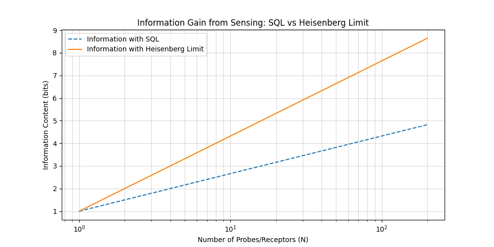

# Information Theory in Quantum Biological Systems

**Agent ID:** 20250531-182000-InfoTheory
**Phenomenon:** Integration (Cross-Phenomenon Analysis)
**Task Type:** Theory

## 1. Introduction

This project explores the application of information theory to quantum biological systems. The goal is to quantify potential information advantages that quantum mechanics might offer in biological contexts. The analysis focuses on four key areas:
- Information capacity of quantum vs. classical channels.
- Entropy changes in biological quantum processes.
- Error correction capabilities and robustness in biological systems.
- Bandwidth limitations in biological sensors.

The work involves theoretical calculations and conceptual modeling using Python scripts located in the `analysis/` directory.

## 2. Methods and Scripts

The following scripts were developed for this analysis:

-   **`analysis/channel_capacity.py`**: Calculates and compares classical (Shannon) and quantum (Holevo) information capacities.
    -   *Classical Capacity*: Modeled using the Binary Symmetric Channel (BSC).
    -   *Quantum Capacity*: Explored via the Holevo quantity (χ), which provides an upper bound on accessible information in a quantum channel.
-   **`analysis/entropy_calculator.py`**: Calculates Shannon entropy for classical probability distributions and Von Neumann entropy for quantum density matrices.
    -   These are used to quantify information content and changes during processes.
-   **`analysis/error_correction_models.py`**: Discusses concepts of error correction and robustness, comparing formal Quantum Error Correction (QEC) ideas with potential analogous mechanisms in biology.
    -   Includes a simulation of a classical repetition code.
-   **`analysis/sensor_bandwidth.py`**: Models and compares information acquisition in sensors limited by the Standard Quantum Limit (SQL) versus the Heisenberg Limit (HL).
    -   Generates plots comparing precision and information content.

Raw formulas and bibliographic references are available in `raw_data/formulas.md` and `sources.bib`, respectively.

## 3. Analysis and Findings

### 3.1 Information Capacity: Quantum vs. Classical Channels

-   **Classical Channel (BSC):** The script `channel_capacity.py` calculates capacity `C = 1 - H(p)` where `H(p)` is binary entropy of error `p`.
    -   For `p_error=0.1`, `C_BSC ≈ 0.531` bits.
    -   For `p_error=0.5` (completely noisy), `C_BSC = 0` bits.
-   **Quantum Channel (Holevo Bound):** The Holevo quantity `χ = S(ρ_avg) - Σ p_x S(ρ_x)` gives an upper bound on information.
    -   For two non-orthogonal states `|0>` and `|+>` (sent with 50/50 probability), `χ ≈ 0.601` bits (from script output). This value can be higher than what's achievable by classical measurements on these states if they are restricted (e.g. von Neumann measurements in a fixed basis).
    -   For two orthogonal states `|0>` and `|1>` (50/50 probability), `χ = 1.0` bit, as expected (equivalent to a noiseless classical bit).
-   **Information Advantage:** Quantum channels can, in principle, transmit more information per channel use than classical channels if states are cleverly encoded, especially when dealing with non-orthogonal states. The Holevo bound quantifies this potential. Biological systems might utilize quantum effects to achieve more efficient information transfer in specific molecular interactions than purely classical models would predict.

### 3.2 Entropy Changes in Biological Quantum Processes

-   The `entropy_calculator.py` script provides tools to calculate Shannon and Von Neumann entropy.
    -   Shannon entropy quantifies uncertainty in classical systems (e.g., `H_uniform_4_states = 2` bits, `H_certain_state = 0` bits).
    -   Von Neumann entropy `S(ρ)` quantifies uncertainty in quantum systems.
        -   Pure states (`ρ = |ψ><ψ|`): `S(ρ) = 0` bits (e.g., `S(|0>) = 0`).
        -   Mixed states: `S(ρ) > 0`. A maximally mixed qubit has `S = 1` bit.
-   **Biological Relevance:**
    -   **Initial State:** A biological system preparing a specific quantum state (e.g., an electron spin in a radical pair, or an excitonic state in photosynthesis) might start in a relatively pure (low entropy) state.
        -   Example from script: `S(initial_state) ≈ 0.1687` bits (for a slightly mixed state).
    -   **Process & Decoherence:** As the quantum state interacts with its environment or undergoes decoherence, it typically becomes more mixed, and its entropy increases.
        -   Example from script: `S(final_state - decohered) ≈ 0.9710` bits (for a more mixed diagonal state).
        -   Change in entropy: `ΔS ≈ 0.8023` bits.
    -   **Information Gain/Loss:** An increase in entropy often corresponds to a loss of specific information about the system's state, or a gain of information by the environment about the system. Conversely, processes that reduce entropy (e.g., measurement or feedback) can imply information gain by an observer or controller. Understanding these entropy dynamics is crucial for tracking information flow.

### 3.3 Error Correction and Robustness

-   The `error_correction_models.py` script explores this conceptually.
-   **Formal QEC:** Complex codes (e.g., Shor's code) are unlikely in biology.
-   **Biological Analogues:**
    -   **Redundancy:** Multiple DNA copies, degenerate genetic codes (classical repetition code simulated: `p_error=0.05` usually corrected, `p_error=0.25` often fails).
    -   **Active Repair:** DNA repair enzymes, protein chaperones. These are sophisticated mechanisms beyond simple redundancy.
    -   **Decoherence Avoidance/Suppression:**
        -   *Decoherence-Free Subspaces (DFS):* Symmetries might protect certain quantum states (e.g., singlet states in radical pairs).
        -   *Quantum Zeno Effect:* Frequent interactions could stabilize states.
        -   *Environmental Shielding:* Hydrophobic pockets creating isolated environments.
-   **Information Advantage:** These mechanisms, while not formal QEC, contribute to the robustness of biological information processing. If quantum effects are involved, these protective strategies are essential for preserving any quantum informational advantage against decoherence. The "advantage" is in maintaining fidelity and function despite noise.

### 3.4 Bandwidth Limitations in Biological Sensors

-   The `sensor_bandwidth.py` script and its plots (`sensor_comparison_output_precision.png`, `sensor_comparison_output_information.png`) compare sensing limits.
    
    
-   **Standard Quantum Limit (SQL):** For `N` independent probes, uncertainty `Δφ ~ 1/√N`.
-   **Heisenberg Limit (HL):** For `N` entangled probes (ideal case), `Δφ ~ 1/N`.
-   **Information Content:** Calculated as `log2(Range/Δφ)`.
    -   For `N=200` probes (from script example, with `sensitivity=0.5`, `range=1.0`):
        -   SQL: `Δφ_SQL ≈ 0.0354`, `Information_SQL ≈ 4.82` bits.
        -   HL:  `Δφ_HL ≈ 0.0025`, `Information_HL ≈ 8.64` bits.
-   **Information Advantage & Bandwidth:**
    -   The HL offers significantly higher precision and thus higher information content for the same number of probes/resources.
    -   This translates to better bandwidth: either resolving finer details (more states) or achieving target precision faster.
    -   **Biological Relevance:** While achieving the full Heisenberg limit is difficult, biological sensors (e.g., in magnetoreception or olfaction) might use quantum effects to surpass classical SQL-like behavior, allowing them to detect very weak signals or subtle differences. The plots visually demonstrate this potential information advantage. The actual advantage depends on the extent to which biological systems can generate and utilize relevant quantum states and mitigate decoherence.

## 4. Quantifying the Information Advantage - Summary

The "information advantage" of quantum processes in biology can be quantified in several ways:

1.  **Higher Channel Capacity (Holevo Bound):** Quantum systems can theoretically pass more information through noisy channels if states are encoded and decoded optimally, potentially exceeding classical limits for the same physical resources.
2.  **Efficient State Representation:** Pure quantum states have zero entropy, representing maximal information about the state itself. Biological systems might leverage this to initialize processes with high fidelity. Changes in Von Neumann entropy track information exchange with the environment.
3.  **Enhanced Robustness:** While not full QEC, mechanisms like DFS or repair pathways allow biological systems to protect information (classical or quantum) from noise, maintaining fidelity where purely classical, unprotected systems might fail. This is an advantage in terms of reliability.
4.  **Superior Sensing Precision (Heisenberg Limit):** Quantum-enhanced sensors can achieve far better precision for the same number of sensing elements/time, leading to a higher rate of information acquisition (bandwidth) about the environment. This is evident in the `~1/N` vs `~1/√N` scaling.

The extent to which these theoretical advantages are realized in specific biological phenomena is an active area of research. This project provides a foundational information-theoretic framework and computational tools to explore these questions.

## 5. Limitations and Future Work

-   The models used are simplified. Real biological systems are vastly more complex.
-   Calculations for quantum channel capacity beyond the Holevo quantity (e.g., actual achievable rates with specific measurements) were not implemented.
-   Biological implementations of QEC-like principles are mostly conceptual analogies here.
-   Experimental verification of these information-theoretic advantages in vivo is a major challenge.

Future work could involve:
-   Applying these models to more specific biological examples (e.g., photosynthetic complexes, radical pair reactions).
-   Incorporating decoherence models more explicitly into channel capacity and sensor models.
-   Exploring the resource costs (energy, time, molecular machinery) of implementing and protecting quantum information in biological systems.
